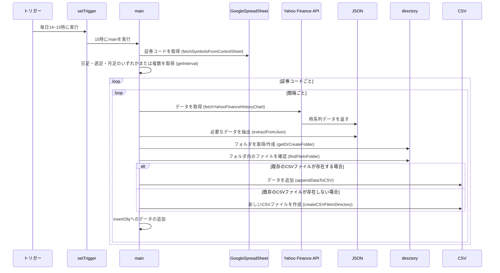

# chart_analysis

このプロジェクトは、Yahoo Finance APIを利用して最新の株価時系列データを取得し、それをグラフで視覚的に表現するといった一連の流れをGoogle Apps Scriptを用いて行うことを目的としています。

# Diagram

# Example
https://github.com/youha6149/chart_analysis/assets/60963226/97f87988-5444-4219-9443-ac5a7abb850e

# Technologies Used

- Google Apps Script
- HTML5

## libralies
- chart.js
- luxon
